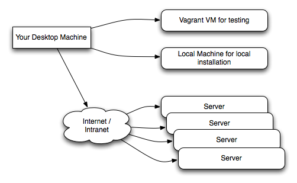

.. FabGIS documentation master file, created by
   sphinx-quickstart on Sun Jun  2 22:29:26 2013.
   You can adapt this file completely to your liking, but it should at least
   contain the root `toctree` directive.

FABGIS
======

Fabric tasks for the busy FOSSGIS professional

FABGIS - its absolutely FAB-U-GIS!

Welcome to the FABGIS project! The purpose of this project is to commoditise
the deployment of FOSSGIS services onto servers. By commoditise we mean
'treat servers as expendable and rapidly replaceable entities that can be
deployed either singularly or en-masse'. :doc:`license` is LGPL 2.1

.. note:: This project is still in its infancy, we have not achieved all our
  goals for initial functionality yet.

.. warning:: While we try our best to make stable and reliable tasks,
  there is the inherent danger that these tasks may break some configuration
  on a running server. Before using in any production environment, test,
  test and test again in a sandboxed environment. We take NO RESPONSIBILITY
  for any bad things that may happen on your system.

  Also note that these scripts do NOT OFFER ANY GUARANTEES OF SECURITY
  against intrusion / exploit - that is YOUR RESPONSIBILITY.

To achieve this we use the wonderful `fabric library <http://fabfile.org>`_. If
you want to get more familiar with fabric, there is a very nice article `here
<http://www.linuxjournal.com/content/fabric-system-administrators-best-friend>`_
which contains enough information to get you started.

What kind of services do we commoditise? Here are a few of the kinds of
activities you can do with FABGIS:

* Install PostgreSQL and PostGIS (both 1.5 and 2.0). We support 1.5 because
  many DJANGO instances still rely on it.
* Install QGIS (both 1.8 and master), built from source for optimum
  performance.
* Install QGIS Server (both 1.8 and master), again built from source.
* Backup and restore PostgreSQL databases (pulling a backup off the server
  or pushing a backup up to the server and restoring it).
* Deploying a website under apache.
* Running tilestream and tilemill
* Deploying a UMN Mapserver instance.

More than anything, FABGIS is a collection of high level commands that can
be used from within your fabric 'fabfile' to make light work of deploying
these kinds of applications onto your server.

We plan on supporting many other activities (tasks in fabric parlance) in the
future.

Learn more
==========

.. toctree::
   :maxdepth: 1

   getting_started
   developers
   changelog
   license
   api
   docker
